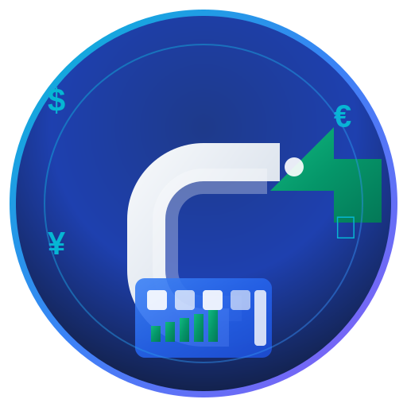

# 🏗️ ConcreteBill - Sistema de Facturación y Gestión Empresarial

<div align="center">



**Sistema completo de contabilidad, facturación y gestión empresarial**

[](https://nextjs.org/)
[](https://www.typescriptlang.org/)
[](https://supabase.com/)
[](https://web.dev/progressive-web-apps/)
[](https://tailwindcss.com/)
[](https://vercel.com/)

</div>

## 📋 Tabla de Contenidos

- [🏗️ ConcreteBill - Sistema de Facturación y Gestión Empresarial](#️-concretebill---sistema-de-facturación-y-gestión-empresarial)
  - [📋 Tabla de Contenidos](#-tabla-de-contenidos)
  - [🚀 Características Principales](#-características-principales)
    - [💼 Módulos de Gestión](#-módulos-de-gestión)
    - [📱 Progressive Web App (PWA)](#-progressive-web-app-pwa)
    - [🎨 Interfaz y Experiencia](#-interfaz-y-experiencia)
  - [🛠️ Stack Tecnológico](#️-stack-tecnológico)
    - [Frontend](#frontend)
    - [Backend](#backend)
    - [Base de Datos](#base-de-datos)
    - [Infraestructura](#infraestructura)
  - [📦 Instalación y Configuración](#-instalación-y-configuración)
    - [Prerrequisitos](#prerrequisitos)
    - [Instalación Local](#instalación-local)
    - [Variables de Entorno](#variables-de-entorno)
    - [Base de Datos](#base-de-datos-1)
  - [🚀 Comandos de Desarrollo](#-comandos-de-desarrollo)
  - [📁 Estructura del Proyecto](#-estructura-del-proyecto)
    - [Directorios Principales](#directorios-principales)
    - [Componentes UI](#componentes-ui)
    - [Hooks Personalizados](#hooks-personalizados)
  - [🔐 Sistema de Autenticación](#-sistema-de-autenticación)
    - [Características de Seguridad](#características-de-seguridad)
    - [Roles y Permisos](#roles-y-permisos)
  - [📊 Módulos Funcionales](#-módulos-funcionales)
    - [🧾 Facturación](#-facturación)
    - [👥 Gestión de Clientes](#-gestión-de-clientes)
    - [📦 Inventario](#-inventario)
    - [🛍️ Productos y Servicios](#️-productos-y-servicios)
    - [💰 Contabilidad](#-contabilidad)
    - [📈 Reportes y Analytics](#-reportes-y-analytics)
    - [🚚 Logística](#-logística)
  - [📱 PWA - Progressive Web App](#-pwa---progressive-web-app)
    - [Características PWA](#características-pwa)
    - [Instalación](#instalación)
    - [Modo Offline](#modo-offline)
  - [🎨 Personalización](#-personalización)
    - [Temas](#temas)
    - [Idiomas](#idiomas)
    - [Responsive Design](#responsive-design)
  - [🔧 API y Endpoints](#-api-y-endpoints)
    - [Rutas Principales](#rutas-principales)
    - [Autenticación API](#autenticación-api)
  - [📦 Scripts de Base de Datos](#-scripts-de-base-de-datos)
  - [🚀 Despliegue](#-despliegue)
    - [Vercel (Recomendado)](#vercel-recomendado)
    - [Variables de Producción](#variables-de-producción)
  - [🧪 Testing y Calidad](#-testing-y-calidad)
  - [📚 Documentación Adicional](#-documentación-adicional)
  - [🤝 Contribución](#-contribución)
  - [📄 Licencia](#-licencia)
  - [📞 Soporte](#-soporte)

## 🚀 Características Principales

### 💼 Módulos de Gestión

- **💳 Facturación Completa**: Emisión de facturas, NCF (República Dominicana), cotizaciones
- **👥 Gestión de Clientes**: CRM integrado con historial de transacciones
- **📦 Control de Inventario**: Stock en tiempo real, movimientos, múltiples almacenes
- **🛍️ Productos y Servicios**: Catálogo completo con precios múltiples por cliente
- **💰 Contabilidad**: Gastos, ingresos, reportes financieros
- **📊 Dashboard Analytics**: Métricas en tiempo real y KPIs empresariales
- **🚚 Logística**: Guías de despacho, control de vehículos y conductores
- **📅 Agenda**: Calendario de eventos, citas y recordatorios
- **🧾 Recibos Térmicos**: Impresión térmica y comprobantes de pago

### 📱 Progressive Web App (PWA)

- **🔄 Instalación Nativa**: Se instala como app en cualquier dispositivo
- **⚡ Modo Offline**: Funcionalidad básica sin conexión a internet
- **🔔 Notificaciones Push**: Alertas y recordatorios automáticos
- **📲 Actualizaciones Automáticas**: Service Worker con cache inteligente
- **🎯 Accesos Directos**: Shortcuts a funciones principales desde el escritorio

### 🎨 Interfaz y Experiencia

- **🌙 Modo Oscuro/Claro**: Temas adaptativos con persistencia
- **📱 100% Responsive**: Desde 320px hasta 8K (7680px+)
- **🌍 Multiidioma**: Español por defecto, preparado para internacionalización
- **♿ Accesibilidad**: Cumple estándares WCAG 2.1
- **⚡ Performance**: Optimizado para máxima velocidad de carga

## 🛠️ Stack Tecnológico

### Frontend
- **Next.js 14.2.16** - Framework React con App Router
- **TypeScript 5.0** - Tipado estático
- **Tailwind CSS 3** - Framework CSS utility-first
- **Radix UI** - Componentes accesibles y sin estilos
- **Framer Motion** - Animaciones fluidas
- **Lucide React** - Iconografía moderna
- **Chart.js & Recharts** - Visualización de datos

### Backend
- **Next.js API Routes** - API serverless
- **Supabase** - Backend-as-a-Service
- **PostgreSQL** - Base de datos relacional
- **Row Level Security (RLS)** - Seguridad a nivel de datos

### Base de Datos
- **PostgreSQL** - Base de datos principal
- **Supabase Auth** - Autenticación y autorización
- **Real-time subscriptions** - Actualizaciones en tiempo real
- **Storage** - Manejo de archivos y documentos

### Infraestructura
- **Vercel** - Hosting y despliegue
- **Edge Functions** - Procesamiento distribuido
- **PWA** - Service Workers y caching
- **WebP/AVIF** - Optimización de imágenes

## 📦 Instalación y Configuración

### Prerrequisitos

```bash
Node.js >= 18.0.0
pnpm >= 8.0.0 (recomendado)
Git
Cuenta en Supabase
```

### Instalación Local

```bash
# 1. Clonar el repositorio
git clone https://github.com/smith-ch/croncretebill.git
cd croncretebill

# 2. Instalar dependencias
pnpm install

# 3. Configurar variables de entorno
cp .env.example .env.local

# 4. Configurar base de datos
pnpm db:setup

# 5. Ejecutar en desarrollo
pnpm dev
```

### Variables de Entorno

```env
# Supabase
NEXT_PUBLIC_SUPABASE_URL=your_supabase_url
NEXT_PUBLIC_SUPABASE_ANON_KEY=your_supabase_anon_key
SUPABASE_SERVICE_ROLE_KEY=your_service_role_key

# App Configuration
NEXT_PUBLIC_APP_URL=http://localhost:3000
NEXT_PUBLIC_APP_ENV=development

# PWA
NEXT_PUBLIC_PWA_VERSION=2.0.0
```

### Base de Datos

```bash
# Ejecutar migraciones en orden
psql -f scripts/01-create-tables.sql
psql -f scripts/02-seed-data.sql
psql -f scripts/03-fix-profiles.sql
# ... continuar con todos los scripts numerados
```

## 🚀 Comandos de Desarrollo

```bash
# Desarrollo
pnpm dev          # Servidor de desarrollo en http://localhost:3000
pnpm build        # Build de producción con verificación PWA
pnpm start        # Servidor de producción
pnpm lint         # Linting con ESLint

# PWA
pnpm verify-pwa   # Verificar archivos y configuración PWA

# Base de datos
pnpm db:setup     # Configurar base de datos inicial
pnpm db:migrate   # Ejecutar migraciones pendientes
pnpm db:seed      # Llenar con datos de prueba
```

## 📁 Estructura del Proyecto

### Directorios Principales

```
croncretebill/
├── app/                    # App Router de Next.js
│   ├── api/               # API Routes
│   ├── dashboard/         # Panel principal
│   ├── invoices/          # Sistema de facturación
│   ├── clients/           # Gestión de clientes
│   ├── inventory/         # Control de inventario
│   ├── products/          # Productos y servicios
│   ├── expenses/          # Gastos y contabilidad
│   ├── reports/           # Reportes y analytics
│   └── settings/          # Configuración
├── components/            # Componentes React
│   ├── ui/               # Componentes base (Radix UI)
│   ├── forms/            # Formularios especializados
│   ├── dashboard/        # Componentes del dashboard
│   ├── invoices/         # Componentes de facturación
│   └── auth/             # Autenticación y seguridad
├── hooks/                # Custom hooks
├── lib/                  # Utilidades y configuración
├── contexts/             # Context providers
├── public/               # Archivos estáticos y PWA
│   ├── icons/           # Iconos PWA (72x72 a 512x512)
│   ├── manifest.json    # Manifest PWA
│   └── sw.js           # Service Worker
├── scripts/              # Scripts de base de datos
└── styles/              # Estilos globales
```

### Componentes UI

```tsx
// Componentes base con Radix UI
├── ui/
│   ├── button.tsx        # Botones con variants
│   ├── input.tsx         # Inputs con validación
│   ├── dialog.tsx        # Modales y dialogs
│   ├── table.tsx         # Tablas con sorting
│   ├── form.tsx          # Formularios con react-hook-form
│   ├── card.tsx          # Cards y containers
│   └── toast.tsx         # Notificaciones
```

### Hooks Personalizados

```tsx
// Hooks especializados
├── hooks/
│   ├── use-user-permissions.ts    # Sistema de permisos
│   ├── use-currency.ts            # Manejo de monedas
│   ├── use-notifications.ts       # Sistema de notificaciones
│   ├── use-debounced-value.ts     # Debounce para búsquedas
│   └── use-auto-logout.ts         # Logout automático
```

## 🔐 Sistema de Autenticación

### Características de Seguridad

- **🔐 Autenticación multifactor** - Email + OTP opcional
- **🔒 Row Level Security** - Aislamiento de datos por empresa
- **⏰ Sesiones temporales** - Auto-logout por inactividad
- **🛡️ Protección de rutas** - Middleware de autorización
- **👥 Gestión de usuarios** - Roles y permisos granulares

### Roles y Permisos

```typescript
// Roles disponibles
type UserRole = 'admin' | 'manager' | 'employee' | 'viewer'

// Permisos por módulo
interface Permissions {
  invoices: 'full' | 'read' | 'create' | 'none'
  clients: 'full' | 'read' | 'none'
  inventory: 'full' | 'read' | 'none'
  reports: 'full' | 'read' | 'none'
  settings: 'full' | 'none'
}
```

## 📊 Módulos Funcionales

### 🧾 Facturación

- **Emisión de facturas** con NCF (República Dominicana)
- **Cotizaciones y presupuestos** con conversión automática
- **Control de secuencias** numeración automática
- **Múltiples monedas** soporte para USD, DOP, EUR
- **Descuentos y taxes** ITBIS y otros impuestos
- **Estados de factura** Pendiente, Pagada, Vencida, Cancelada
- **Historial de pagos** seguimiento completo

### 👥 Gestión de Clientes

- **CRM completo** con historial de interacciones
- **Segmentación** por tipo, región, volumen
- **Precios personalizados** por cliente y producto
- **Límites de crédito** control de exposición
- **Comunicación** email y WhatsApp integration
- **Documentos** contratos, acuerdos, certificados

### 📦 Inventario

- **Control de stock** en tiempo real
- **Múltiples almacenes** gestión distribuida
- **Movimientos automáticos** entradas, salidas, ajustes
- **Puntos de reorden** alertas automáticas
- **Valorización** FIFO, LIFO, Promedio ponderado
- **Reportes de inventario** valorizado, rotación, obsoleto

### 🛍️ Productos y Servicios

- **Catálogo unificado** productos físicos y servicios
- **Categorización** jerárquica con filtros
- **Precios múltiples** por cliente, cantidad, temporada
- **Variantes** tallas, colores, especificaciones
- **Imágenes** galería con optimización automática
- **Códigos de barras** generación y lectura

### 💰 Contabilidad

- **Plan de cuentas** personalizable
- **Asientos automáticos** desde facturas y pagos
- **Gastos recurrentes** automatización mensual
- **Conciliación bancaria** importación de estados
- **Reportes financieros** P&L, Balance, Cash Flow
- **Presupuestos** vs real con variaciones

### 📈 Reportes y Analytics

- **Dashboard ejecutivo** KPIs en tiempo real
- **Reportes operativos** ventas, inventario, clientes
- **Analytics predictivos** tendencias y forecasting
- **Exportación** PDF, Excel, CSV
- **Filtros avanzados** por período, cliente, producto
- **Gráficos interactivos** drill-down capability

### 🚚 Logística

- **Guías de despacho** con tracking
- **Control de vehículos** mantenimiento y costos
- **Gestión de conductores** licencias y documentos
- **Rutas optimizadas** planificación de entregas
- **Proof of delivery** firmas y fotos
- **Integración GPS** seguimiento en tiempo real

## 📱 PWA - Progressive Web App

### Características PWA

```json
{
  "name": "ConcreteBill - Contabilidad & Facturación",
  "short_name": "ConcreteBill",
  "display": "standalone",
  "start_url": "/dashboard",
  "theme_color": "#3b82f6",
  "background_color": "#0f172a"
}
```

### Instalación

1. **Desktop**: Chrome → ⋮ → Instalar ConcreteBill
2. **Mobile**: Safari/Chrome → Agregar a pantalla de inicio
3. **Automática**: Banner de instalación al usar la app

### Modo Offline

- **Cache Strategy**: NetworkFirst para datos, CacheFirst para assets
- **Offline Page**: Página personalizada sin conexión
- **Background Sync**: Sincronización automática al reconectar
- **Storage**: IndexedDB para datos críticos offline

## 🎨 Personalización

### Temas

```tsx
// Soporte para temas personalizados
const themes = {
  light: { /* valores claros */ },
  dark: { /* valores oscuros */ },
  blue: { /* tema azul corporativo */ },
  green: { /* tema verde */ }
}
```

### Idiomas

- **Español** (por defecto) - 100% completo
- **Inglés** - En desarrollo
- **Preparado para**: Francés, Portugués, etc.

### Responsive Design

```css
/* Breakpoints soportados */
xs: 320px   /* Móviles pequeños */
sm: 640px   /* Móviles */
md: 768px   /* Tablets */
lg: 1024px  /* Laptops */
xl: 1280px  /* Desktops */
2xl: 1536px /* Pantallas grandes */
4k: 3840px  /* 4K displays */
8k: 7680px  /* 8K displays */
```

## 🔧 API y Endpoints

### Rutas Principales

```typescript
// Rutas de API disponibles
/api/auth/*           // Autenticación
/api/invoices/*       // Facturación
/api/clients/*        // Clientes
/api/products/*       // Productos
/api/inventory/*      // Inventario
/api/reports/*        // Reportes
/api/uploads/*        // Archivos
/api/manifest         // PWA Manifest
```

### Autenticación API

```typescript
// Headers requeridos
{
  'Authorization': 'Bearer <supabase_session_token>',
  'Content-Type': 'application/json',
  'X-Client-Version': '2.0.0'
}
```

## 📦 Scripts de Base de Datos

```bash
# Scripts en orden de ejecución
01-create-tables.sql              # Tablas base
02-seed-data.sql                  # Datos iniciales
03-fix-profiles.sql               # Perfiles de usuario
04-default-faqs.sql               # FAQs por defecto
05-auto-numbers-and-deliveries.sql # Numeración automática
...
34-fix-customer-pricing-datatype.sql # Último script
```

## 🚀 Despliegue

### Vercel (Recomendado)

```bash
# 1. Instalar Vercel CLI
npm i -g vercel

# 2. Login y desplegar
vercel login
vercel --prod

# 3. Configurar dominio personalizado
vercel domains add tu-dominio.com
```

### Variables de Producción

```env
# Supabase Production
NEXT_PUBLIC_SUPABASE_URL=https://xxx.supabase.co
NEXT_PUBLIC_SUPABASE_ANON_KEY=xxx
SUPABASE_SERVICE_ROLE_KEY=xxx

# Production URLs
NEXT_PUBLIC_APP_URL=https://tu-dominio.com
NEXT_PUBLIC_PWA_VERSION=2.0.0
```

## 🧪 Testing y Calidad

```bash
# Linting
pnpm lint             # ESLint + TypeScript

# Verificaciones PWA
pnpm verify-pwa       # Validar configuración PWA

# Performance
pnpm build            # Build con análisis de bundles
pnpm lighthouse       # Audit con Lighthouse
```

## 📚 Documentación Adicional

- [📖 API Documentation](./docs/api.md)
- [🎨 Design System](./docs/design-system.md)
- [🔐 Security Guide](./docs/security.md)
- [📱 PWA Features](./docs/pwa.md)
- [🌍 Internationalization](./docs/i18n.md)
- [📊 Database Schema](./docs/database.md)

## 🤝 Contribución

```bash
# 1. Fork el repositorio
# 2. Crear rama feature
git checkout -b feature/nueva-funcionalidad

# 3. Commit con conventional commits
git commit -m "feat: agregar módulo de inventario"

# 4. Push y crear PR
git push origin feature/nueva-funcionalidad
```

### Estándares de Código

- **TypeScript** obligatorio
- **ESLint + Prettier** para formato
- **Conventional Commits** para mensajes
- **Tests** para nuevas funcionalidades
- **Documentación** para APIs públicas

## 📄 Licencia

Este proyecto está bajo la Licencia MIT. Ver [LICENSE](LICENSE) para más detalles.

## 📞 Soporte

### 🆘 Soporte de Emergencia
- **Email**: smithrodriguez345@gmail.com
- **Respuesta**: < 24 horas
- **Disponibilidad**: 24/7 para problemas críticos

### 🔧 Soporte Técnico
- **Email**: smithrodriguez345@gmail.com
- **Respuesta**: < 48 horas
- **Horario**: Lunes a Viernes, 9AM-6PM (GMT-4)

### 💡 Recursos
- **FAQ**: Disponible en `/faq` dentro de la aplicación
- **Documentación**: Este README y `/docs`
- **Updates**: Seguir repositorio para nuevas versiones

---

<div align="center">

**🏗️ Desarrollado con ❤️ para empresas que construyen el futuro**

[🌐 Website](https://concretebill.vercel.app) • [📧 Contacto](mailto:smithrodriguez345@gmail.com) • [📱 Demo](https://concretebill.vercel.app/dashboard)

</div>