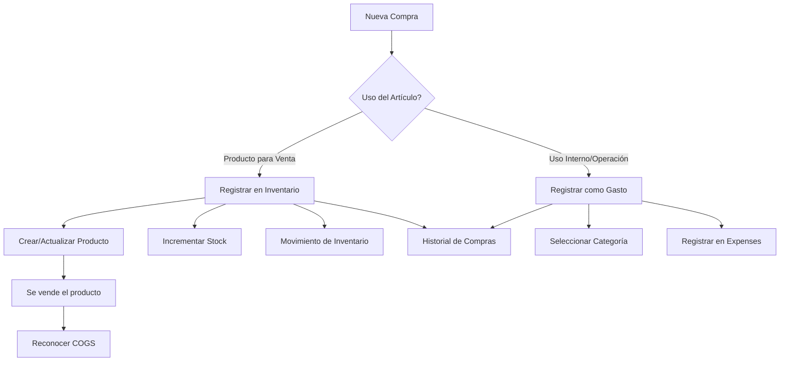

# Sistema de Clasificación de Compras

## Descripción General

Sistema que clasifica automáticamente las compras como **INVENTARIO** (productos para venta) o **GASTO** (uso interno/operación), previniendo errores contables.

## Problema que Resuelve

**Antes:**
- Los usuarios registraban mercancía para venta como gastos operativos
- Error contable: reconocimiento anticipado de gastos
- Costos inflados en reportes de pérdidas y ganancias

**Después:**
- Clasificación clara al momento de la compra
- Mercancía para venta → Inventario (activo)
- Uso interno → Gasto (costo operativo)
- El costo de venta se reconoce solo cuando se vende el producto

## Flujo de Clasificación



## Implementación

### 1. Tabla de Base de Datos

```sql
-- Crear tabla de historial de compras
CREATE TABLE purchase_history (
    id UUID PRIMARY KEY DEFAULT uuid_generate_v4(),
    user_id UUID NOT NULL REFERENCES auth.users(id) ON DELETE CASCADE,
    product_id UUID REFERENCES products(id) ON DELETE SET NULL,
    purchase_type VARCHAR(20) NOT NULL CHECK (purchase_type IN ('inventory', 'expense')),
    description TEXT NOT NULL,
    amount DECIMAL(10, 2) NOT NULL,
    quantity DECIMAL(10, 2),
    unit_cost DECIMAL(10, 2),
    expense_category VARCHAR(50),
    supplier VARCHAR(255),
    receipt_number VARCHAR(100),
    purchase_date DATE NOT NULL,
    notes TEXT,
    created_at TIMESTAMP WITH TIME ZONE DEFAULT NOW()
);

-- Índices para optimización
CREATE INDEX idx_purchase_history_user_id ON purchase_history(user_id);
CREATE INDEX idx_purchase_history_type ON purchase_history(purchase_type);
CREATE INDEX idx_purchase_history_date ON purchase_history(purchase_date);
CREATE INDEX idx_purchase_history_product_id ON purchase_history(product_id);

-- RLS Policies
ALTER TABLE purchase_history ENABLE ROW LEVEL SECURITY;

CREATE POLICY "Users can view own purchase history"
    ON purchase_history FOR SELECT
    USING (auth.uid() = user_id);

CREATE POLICY "Users can insert own purchase history"
    ON purchase_history FOR INSERT
    WITH CHECK (auth.uid() = user_id);

CREATE POLICY "Users can update own purchase history"
    ON purchase_history FOR UPDATE
    USING (auth.uid() = user_id);

CREATE POLICY "Users can delete own purchase history"
    ON purchase_history FOR DELETE
    USING (auth.uid() = user_id);
```

### 2. Componente del Formulario

**Archivo:** `components/forms/purchase-classification-form.tsx`

**Características:**
- Radio buttons para seleccionar tipo: Inventario o Gasto
- Validaciones según tipo seleccionado
- Cálculo automático de costo unitario
- Integración con productos existentes
- Mensajes informativos sobre tratamiento contable

### 3. Lógica de Registro

#### Opción 1: Producto para Venta (Inventario)

```typescript
if (purchaseType === 'inventory') {
  // 1. Buscar producto existente por nombre
  const existingProduct = await supabase
    .from('products')
    .select('id, current_stock, cost_price')
    .eq('user_id', dataUserId)
    .eq('name', description)
    .maybeSingle()

  if (existingProduct) {
    // Actualizar stock y costo promedio
    const newStock = existingProduct.current_stock + quantity
    const newCostPrice = 
      (existingProduct.cost_price * existingProduct.current_stock + amount) / newStock
    
    await supabase
      .from('products')
      .update({
        current_stock: newStock,
        available_stock: newStock,
        cost_price: newCostPrice
      })
      .eq('id', existingProduct.id)
  } else {
    // Crear nuevo producto
    await supabase
      .from('products')
      .insert({
        name: description,
        cost_price: amount / quantity,
        current_stock: quantity,
        available_stock: quantity,
        unit_price: (amount / quantity) * 1.3 // Margen 30%
      })
  }

  // 2. Registrar movimiento de stock
  await supabase
    .from('stock_movements')
    .insert({
      product_id: productId,
      movement_type: 'entrada',
      quantity_change: quantity,
      notes: `Compra: ${description}`
    })

  // 3. Guardar en historial
  await supabase
    .from('purchase_history')
    .insert({
      purchase_type: 'inventory',
      product_id: productId,
      description,
      amount,
      quantity,
      unit_cost: amount / quantity
    })
}
```

#### Opción 2: Uso Interno (Gasto)

```typescript
if (purchaseType === 'expense') {
  // 1. Registrar como gasto
  await supabase
    .from('expenses')
    .insert({
      description,
      amount,
      category: expense_category,
      expense_date: purchase_date,
      receipt_number,
      notes
    })

  // 2. Guardar en historial
  await supabase
    .from('purchase_history')
    .insert({
      purchase_type: 'expense',
      description,
      amount,
      expense_category,
      purchase_date
    })
}
```

## Categorías de Gasto

Las categorías disponibles para gastos operativos:

1. **Empaque y Embalaje** - Materiales de empaque
2. **Servicios** - Electricidad, agua, internet
3. **Transporte y Logística** - Envíos, fletes
4. **Publicidad y Marketing** - Promociones, anuncios
5. **Insumos Operativos** - Materiales de uso
6. **Mantenimiento** - Reparaciones, mantenimiento
7. **Material de Oficina** - Papelería, suministros
8. **Servicios Profesionales** - Contabilidad, legal
9. **Combustible** - Gasolina, diesel
10. **Otros Gastos** - Misceláneos

## Uso del Componente

### En una página existente

```typescript
import { PurchaseClassificationForm } from '@/components/forms/purchase-classification-form'

export default function PurchasesPage() {
  const handleSuccess = () => {
    // Refrescar datos
    fetchPurchases()
    toast({ title: "Compra registrada exitosamente" })
  }

  return (
    <div>
      <h1>Registrar Nueva Compra</h1>
      <PurchaseClassificationForm 
        onSuccess={handleSuccess}
        onCancel={() => router.back()}
      />
    </div>
  )
}
```

### Como modal/diálogo

```typescript
<Dialog open={showPurchaseForm} onOpenChange={setShowPurchaseForm}>
  <DialogContent className="max-w-4xl">
    <DialogHeader>
      <DialogTitle>Nueva Compra</DialogTitle>
    </DialogHeader>
    <PurchaseClassificationForm 
      onSuccess={() => {
        setShowPurchaseForm(false)
        fetchData()
      }}
      onCancel={() => setShowPurchaseForm(false)}
    />
  </DialogContent>
</Dialog>
```

## Mensajes al Usuario

### Alert para Inventario

```
ℹ️ Importante: La mercancía para venta se registra como inventario 
   y solo se convierte en gasto (costo de venta) cuando se vende.
```

### Confirmación de Registro

**Inventario:**
```
✓ Producto creado
  "Cemento Portland 50kg" agregado al inventario con 100 unidades
```

**Gasto:**
```
✓ Gasto registrado
  Gasto de $5,000.00 registrado en categoría "Transporte y Logística"
```

## Validaciones

1. **Descripción obligatoria** - No puede estar vacía
2. **Monto mayor a 0** - No se permiten montos negativos o cero
3. **Cantidad obligatoria para inventario** - Debe ser mayor a 0
4. **Categoría obligatoria para gastos** - Debe seleccionar una
5. **Fecha válida** - No puede ser futura

## Reportes y Análisis

### Historial de Compras

```sql
-- Ver todas las compras del mes
SELECT 
    purchase_date,
    description,
    purchase_type,
    amount,
    CASE 
        WHEN purchase_type = 'inventory' THEN 'Inventario'
        WHEN purchase_type = 'expense' THEN expense_category
    END as category
FROM purchase_history
WHERE user_id = $1
    AND purchase_date >= date_trunc('month', CURRENT_DATE)
ORDER BY purchase_date DESC;
```

### Resumen por Tipo

```sql
-- Total invertido en inventario vs gastos
SELECT 
    purchase_type,
    COUNT(*) as total_purchases,
    SUM(amount) as total_amount,
    AVG(amount) as avg_amount
FROM purchase_history
WHERE user_id = $1
    AND purchase_date BETWEEN $2 AND $3
GROUP BY purchase_type;
```

### Análisis de Gastos

```sql
-- Gastos por categoría
SELECT 
    expense_category,
    COUNT(*) as count,
    SUM(amount) as total,
    AVG(amount) as average
FROM purchase_history
WHERE user_id = $1
    AND purchase_type = 'expense'
    AND purchase_date >= date_trunc('month', CURRENT_DATE)
GROUP BY expense_category
ORDER BY total DESC;
```

## Beneficios

### 1. Contabilidad Correcta
- ✅ Separación clara entre activos y gastos
- ✅ Reconocimiento correcto de COGS al vender
- ✅ Reportes financieros precisos

### 2. Prevención de Errores
- ✅ Interfaz guiada evita confusiones
- ✅ Mensajes informativos educativos
- ✅ Validaciones automáticas

### 3. Trazabilidad
- ✅ Historial completo de compras
- ✅ Relación con productos vendidos
- ✅ Reportes de análisis

### 4. Eficiencia
- ✅ Proceso rápido de registro
- ✅ Actualización automática de inventario
- ✅ Cálculos automáticos de costos

## Próximos Pasos

1. **Migración de Datos** - Clasificar compras antiguas
2. **Reportes Avanzados** - Dashboards de análisis
3. **Alertas** - Notificaciones de stock bajo
4. **Integración** - Con sistemas de facturación
5. **Multi-moneda** - Soporte para compras en USD

## Notas de Implementación

- La tabla `purchase_history` es el registro maestro de todas las compras
- Los productos se actualizan con costo promedio ponderado
- Las categorías de gasto pueden personalizarse por usuario
- El sistema soporta proveedores recurrentes
- Posibilidad de adjuntar facturas (futura mejora)
